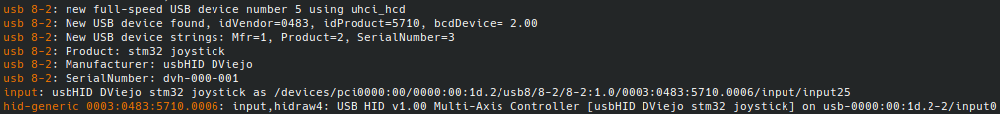
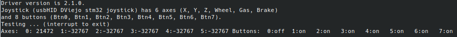

# stm32f103C8 Bluepill joystick demo

## Demo program
  
Created by Diego Viejo dviejo at ua.es for educational purposes
  
on May the fourth 2020 ;)
 
 
Uses libOpenCM3 HAL Library and FreeRTOS
 * Thanks to Warren Gay and his "Beginning STM32: Developing with FreeRTOS, libopencm3 and GCC"
 
I've picked up ideas from here (thanks a lot for sharing your knowledge):

* https://satoshinm.github.io/blog/171227_stm32hid_pill_duck_scriptable_usb_hid_device_using_an_stm32_blue_pill_from_mouse_jigglers_to_rubber_duckies.html
* https://hackaday.io/project/163715-wii-nunchuk-as-a-usb-hid-controller/log/159261-first-steps-with-stm32-usb-firmware

And also from Arduino Joystick library from MHeironimus:
* https://github.com/MHeironimus/ArduinoJoystickLibrary
 
The Bluepill is configured as a multiaxis joystick with:
    * 8 buttons
    * 6 axis: xAxis, yAxis, zAxis, Accelerator, Brake, Steering
  
    Buttons are pressed every 500ms in a sequence, then released in a sequence too, and so on.
    xAxis is moved back and forth
  
This firmware has been flashed in a stm32f103C8 Bluepill device and tested using linux jstest program.





## Software Setup

I've been using the Toolchain for compiling and flashing stm32 firmware as described in the book "Beginning STM32: Developing with FreeRTOS, libopencm3 and GCC" by Warren Gay. The procedure for setting up all the software can be resumed as follows:

1. Linux. Remove any other pseudo-operating-system and install linux on your computer now. --Ironic mode off-- Now, I am a linux user. I don't know how to do this software setup for other OS. If you want to compile it in other OS, take a look at the book.
2. Assuming that you are using any Ubuntu flavor (I use Kubuntu in my computer), open a text terminal and type the next commands (the first one is the only one debian apt dependant, the others are the same for every OS):

```

    $ sudo apt install build-essential git gcc-arm-none-eabi
    $ git clone https://github.com/ve3wwg/stm32f103c8t6.git
    $ cd stm32f103c8t6
    $ git clone https://github.com/libopencm3/libopencm3.git
    $ cd rtos
    $ git clone https://github.com/FreeRTOS/FreeRTOS.git
    $ git clone https://github.com/dviejo/stm32joystick_demo.git
```

3. Edit the file Project.mk in folder stm32f103c8t6/rtos and modify the line `FREERTOS ?= FreeRTOSv10.0.1` to `FREERTOS ?= FreeRTOS`
4. Build the firmware

```
    $ cd ~/stm32f103c8t6
    $ make
    $ cd rtos/stm32joystick_demo/
    $ make
    $ make flash
```
5. You can eliminate copiling files typing `$ make clean` or you can make a clean start by typing `$ make clobber`
6. Enjoy!
## License

stm32joystick_demo code is released under the terms of the GNU Lesser General Public License (LGPL), version 3 or later.
 
